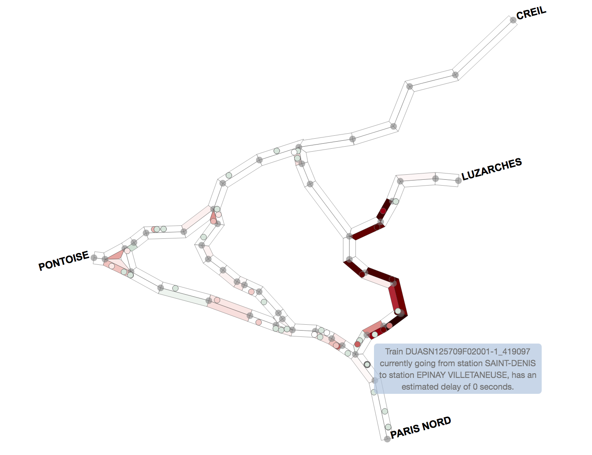
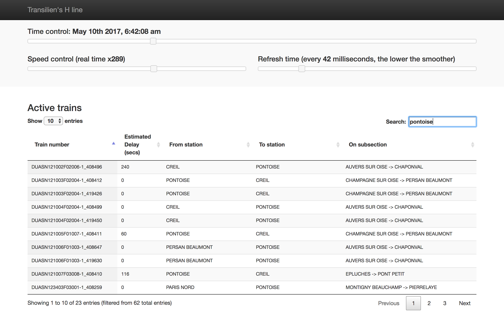
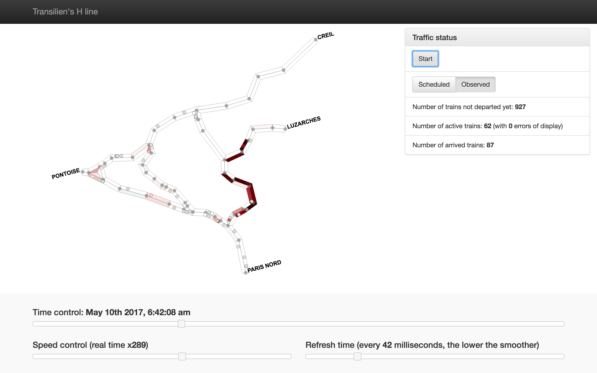

# Visualization of Transilien's network delays

## Overview

This repository is part of a project with SNCF R&D department to provide predictions of delays over Transilien's railroad network. This work is an attempt to visualize and understand how delays occur.

The main tool is a map of the network (graph) made of stations and routes. 

## Screenshots

## The main steps

### Initialization
Parsing data.
Creating graphs.
Preprocessing trains' trips to find shortest path and extrapolate missing data about delays.
Preprocessing summary of trains' delays.
Render interaction tools (sliders/buttons).
Render initial map: stations, subsections.
Render initial datatable.
Render graph of delays over day.

### Rendering at time
At each time modification:
- compute active trips state.
- compute network state.
- render trains.
- render subsections jams.
- render datatable.

## Credits
The amazing work done by Michael Barry and Brian Card on the  [MBTA](http://mbtaviz.github.io/) has inspired me. Both for visual conception, and some tricky parts of code for geometrical calculations.

## Source code and raw data
Source code is available here on github.
Raw data comes from:
- Transilien gtfs files on their website
- Extraction of their API I made available on an AWS S3 container here.